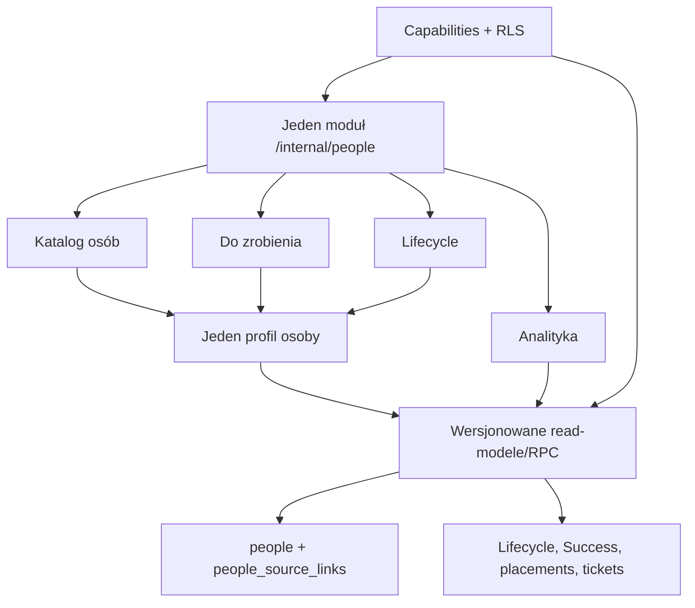

# Audyt i plan scalenia People Ops + Consultant Success

> Data audytu: **2026-07-16**
>
> Zakres: `/internal/people` oraz `/internal/people/success`
>
> Produkcja: `https://compass.dynaminds.pl`
>
> Źródło prawdy kodu: `origin/main` = `660dd0a1b7bb2a6eb40eaa7b3f5f8c280288b14e`
>
> Wersja potwierdzona na produkcji przez `/api/health`: `660dd0a1...`, status `healthy`, Supabase `healthy`
>
> Status dokumentu: **rekomendacja i szczegółowy plan implementacji; bez zmian produkcyjnych**

Ten dokument aktualizuje stan po wdrożeniu pierwszej wersji People Ops i rozszerza zakres o Consultant Success. Dla tego przedsięwzięcia zastępuje wcześniejszy plan `COMPASS/docs/people-ops-unify-plan.md`, który pozostaje zapisem historycznych założeń.

## 1. Streszczenie wykonawcze

Rekomenduję scalić oba obszary w **jeden moduł „People”**, jeden katalog osób i jeden profil osoby. Nie rekomenduję natomiast natychmiastowego scalenia wszystkich tabel w jedną tabelę ani przepisywania działających procesów w jednym wdrożeniu.

Najbezpieczniejszy kierunek to:

1. natychmiast zamknąć potwierdzone luki bezpieczeństwa i błędy integralności;
2. ujednolicić definicje statusów, KPI, dat, właścicieli i dostępu;
3. dodać kanoniczną warstwę tożsamości osoby oraz wersjonowane read-modele;
4. przenieść listy na paginację i agregacje SQL;
5. zbudować jeden shell `/internal/people` oraz jeden profil osoby;
6. pozostawić stare URL-e jako redirecty i wyłączać legacy dopiero po okresie zgodności danych.

Obecne dwa moduły nie są tylko dwoma widokami tych samych danych. Reprezentują dwa różne modele:

- **People Ops** jest operacyjnym hubem lifecycle, placementów, odejść, benchu, ticketów i archiwum;
- **Consultant Success** jest prywatną warstwą TCM: monitoring relacji, health, check-iny, pulse, feedback i action steps.

Docelowo Consultant Success powinien być **prywatną warstwą profilu osoby i filtrem kolejki pracy**, a nie drugim katalogiem tych samych 588 kontraktorów.

### Najważniejsze wnioski

- Nie potwierdzono awarii całego modułu ani błędu P0 w samym renderowaniu UI.
- Potwierdzono dwa problemy P0 w politykach bazy, które należy naprawić przed redesignem:
  - każdy użytkownik `authenticated` może dopisać fałszywy, nieusuwalny wpis do `lifecycle_events`;
  - ścieżka INSERT komentarza `is_internal=false` nie wymaga dostępu do wskazanego ticketu.
- „Aktualni kontraktorzy”, aktywność Success i aktywne placementy oznaczają dziś różne rzeczy. Produkcyjna analityka pokazuje `588/588 aktywnych`, roster `288`, a monitoring Success `0 aktywnych`.
- Success jest technicznie wdrożony, ale operacyjnie niemal nieuruchomiony: 588 ustawień jest nieaktywnych i ma health `unknown`; brak check-inów, feedbacków, tasków, pulse i delivery; 587 osób nie ma ownera TCM.
- Największy problem UX to renderowanie całych zbiorów bez paginacji: 588 wierszy i ok. 1,26 MB HTML w katalogu Success, 610 wierszy w Onboardingu People Ops i 378 wierszy w Exit.
- Część KPI liczy obiekty, których odpowiadające listy nie pokazują, a błędy zapytań są często zamieniane na prawidłowy pusty stan.
- Bieżąca lokalna gałąź `feat/consultant-success-final-gaps` (`f6d96c3`) nie jest produkcją, jest oparta o starszy commit i nie zawiera dwóch ostatnich poprawek `origin/main`. Nie wolno jej merge'ować bez rebase i naprawy słownika `critical`/`urgent`.

## 2. Metoda i granice audytu

Audyt oparto na czterech źródłach:

1. produkcyjnej sesji zalogowanego użytkownika w Chrome;
2. kodzie z bieżącego `origin/main`, nie z lokalnej gałęzi roboczej;
3. aktywnych politykach i danych projektu Supabase `compass-prod` (`shduiynzemftkqqefscd`), odczytanych read-only;
4. istniejących migracjach, testach i dokumencie `COMPASS/docs/people-ops-unify-plan.md`.

Nie wykonywano zapisów do produkcji, nie klikano akcji wysyłających wiadomości, nie modyfikowano danych i nie używano lokalnego Dockera.

Historyczny błąd konsoli People Ops `TypeError: network error` pochodził ze starego stanu karty. Świeży reload działał poprawnie, dlatego nie jest klasyfikowany jako aktualna regresja. Nadal warto jednak poprawić generyczny error boundary i obserwowalność, ponieważ obecna aplikacja często nie rozróżnia awarii od pustej listy.

### Skala ważności

- **P0** — luka bezpieczeństwa, utrata integralności lub ryzyko nieautoryzowanego działania; poprawić natychmiast.
- **P1** — błędne dane, błędna automatyzacja albo istotne utrudnienie codziennej pracy; przed scaleniem UI.
- **P2** — wydajność, niespójna architektura lub poważny dług UX; w ramach scalenia.
- **P3** — dostępność, nazewnictwo i utrzymanie; nie blokuje containment, ale musi wejść do Definition of Done.

## 3. Stan produkcyjny — obserwacje liczbowe

### 3.1 People Ops

| Obszar | Obserwacja na produkcji | Konsekwencja |
|---|---:|---|
| Zakładki modułu | 7: Pulpit, Onboarding, Exit, Kontraktorzy, Sprawy, Analityka, Szablony | Dużo funkcji, ale brakuje części akcji dostępnych nadal tylko w starym Lifecycle. |
| Onboarding | 610 wierszy DOM, ok. 486 kB HTML | Brak paginacji; powolne skanowanie i duży koszt renderowania. |
| Wejścia kontraktorów | 305 rekordów plus druga tabela wywiadów dla tej samej populacji | Powielenie kontekstu i brak jasnego podziału „placement” vs „wywiad”. |
| Exit | 378 wierszy: 44 bench, 333 pozycje exit/departure, 1 filtrowane zejście | Trzy różne procesy na jednej długiej stronie. |
| Roster | 288 wierszy, z czego 262 oznaczone jako archiwum | Nazwa „Aktualni kontraktorzy” jest nieprawdziwa. |
| Przyszłe placementy | co najmniej 2 rekordy ze startem po dniu audytu | „Aktualni” obejmuje także jeszcze nierozpoczęte współprace. |
| Sprawy — domyślny widok | 88 kart w skrzynce administracja@ | Brak paginacji i duże obciążenie poznawcze. |
| Sprawy — analityka | 235 wszystkich, 24 otwarte | Kafle i kolejki nie korzystają z identycznego zakresu kategorii. |
| Powielone tytuły spraw | 17 grup / 34 karty | Rozmowa lub onboarding może być widoczny jako zdublowany obiekt operacyjny. |
| Analityka kontraktorów | `588/588 aktywni/wszyscy` | Status rekordu kontraktora jest mylony z aktywnym placementem. |
| Klienci/ownerzy | m.in. `XPERI` i `Xperi`; `Błażej` i `Błażej Bęben` | KPI są dzielone przez brak normalizacji identity/master data. |

Dodatkowe potwierdzone problemy widoku:

- zamknięte/rozwiązane sprawy nadal pokazują etykietę „Przeterminowane” lub przyszłe SLA;
- istnieją rekordy z błędem tekstowym `onboardng`;
- priorytety są nazywane równolegle `P1/P2/P3`, `Pilny/Wysoki/Normalny` i `urgent/high/normal`;
- przy jednym z wewnętrznych onboardingów link rekordu nie ma nazwy osoby;
- w rosterze są dokładne duplikaty osoba + klient oraz warianty wielkości liter;
- brak stawki przychodowej może generować ujemną „marżę”, zamiast stanu `brak danych`;
- zakładka Szablony pokazuje tylko szablony employee lifecycle, mimo ogólnej nazwy modułu.

### 3.2 Consultant Success

| Obszar | Obserwacja na produkcji | Konsekwencja |
|---|---:|---|
| Kontraktorzy | 588 | Drugi katalog tej samej populacji. |
| Success settings | 588, wszystkie `inactive + unknown` | Moduł nie jest skonfigurowanym aktywnym portfolio. |
| Owner TCM | brak u 587/588 | Nie można uczciwie liczyć workloadu ani uruchamiać automatyzacji. |
| E-mail kontraktora w źródle | 0 | Pulse/email nie powinien być dostępny bez data-readiness. |
| `contractors.profile_id` | 0 powiązań | Brak kanonicznego linku do profilu użytkownika. |
| Placements | 36, tylko 17 z `contractor_id`; 19 niepowiązanych | Część aktywności nie może być poprawnie przypisana do osoby. |
| Check-iny / feedback / taski / pulse / delivery | 0 | Puste KPI są technicznie prawdziwe dla nowego modelu, ale nie opisują pracy legacy. |
| Rozmowy legacy | 147 | Operacyjna historia istnieje poza nowymi obiektami Success. |
| Katalog Success | 588 wierszy, ok. 1,26 MB HTML, ok. 57,7 tys. px wysokości | Brak paginacji/virtualizacji, słaba nawigacja klawiaturą. |
| Dashboard | KPI 0, ale sekcja priorytetów zawiera 5 pilnych/krytycznych rozmów legacy | Dwa modele pracy pokazują sprzeczny obraz na tym samym ekranie. |
| Analityka | KPI 0, ale „Klienci wymagający uwagi” pokazują duże liczby kontraktorów | Lista klientów jest myląco opisana jako ryzyko, gdy health jest nieznany. |

Dodatkowe problemy widoku:

- Success ma własną drugą nawigację: Pulpit, Konsultanci, Check-iny, Analityka;
- layout tworzy zagnieżdżony element `<main>` w `<main>`;
- wiersze katalogu są klikalne myszą, lecz nie są prawdziwymi linkami i nie mają obsługi klawiatury;
- dashboard eksponuje całe prywatne notatki, zamiast krótkiego powodu/preview;
- surowe enumy są pokazywane jako `Rozmowa: follow_up`, `inne`, `szkolenia`;
- rekordy typu DATE są prezentowane z techniczną godziną `00:00`;
- tożsamość autora jest rozbita między `Błażej`, `Błażej Bęben` i inne warianty;
- przycisk „Wyślij pulse survey” jest aktywny mimo braku e-maila;
- follow-up z rozmowy istnieje na Timeline, ale nie jako Action Step;
- widok Check-inów jest pusty i odsyła użytkownika do 588-wierszowego katalogu, zamiast do kolejki konfiguracji.

## 4. Potwierdzone błędy i ryzyka

### P0.1 — każdy authenticated może fałszować immutable lifecycle audit

Aktywna polityka produkcyjna `lifecycle_events_insert_authenticated` ma:

```sql
FOR INSERT TO authenticated
WITH CHECK (true)
```

Jednocześnie tabela jest opisana jako niezmienny audit log, a trigger blokuje UPDATE i DELETE. Zwykły zalogowany użytkownik może więc dopisać zdarzenie dla dowolnego profilu, np. `exited`, `manager_changed` albo `offboarding_started`, po czym wpis jest nieusuwalny zwykłą ścieżką.

Źródło: `COMPASS/supabase/migrations/20260517000001_phase22a_profile_lifecycle_columns.sql:121-156` oraz aktywna polityka `pg_policies` na produkcji.

**Naprawa:**

- odebrać INSERT rolom `anon` i `authenticated`;
- zapisywać event wyłącznie z triggera lub wąskiego RPC z kontrolą aktora i dozwolonej zmiany stanu;
- `created_by` wyliczać po stronie DB, nie przyjmować z payloadu;
- dodać test, że consultant nie może dopisać eventu sobie ani innej osobie.

### P0.2 — komentarz nieinternalny można dopisać do ticketu bez prawa dostępu

Aktywna polityka INSERT dla `support_ticket_comments` pozwala przejść warunek przez samo `NOT is_internal`. Nie zawiera wtedy obowiązkowego predykatu, że aktor ma dostęp do `ticket_id`.

Źródło: `COMPASS/supabase/migrations/20260608000002_phase37b_unified_tickets.sql:170-185` oraz aktywna polityka `pg_policies`.

To pozwala użytkownikowi znającemu UUID ticketu dopisać komentarz jako siebie do obcego ticketu. Polityka SELECT dodatkowo opiera dostęp na pośrednim zachowaniu RLS `support_tickets`; powinna mieć jawny, wspólny predykat, a nie dwa różne kontrakty dla SELECT i INSERT.

**Naprawa:**

- utworzyć jedną, testowalną funkcję `can_access_support_ticket(ticket_id)`;
- użyć jej obowiązkowo w SELECT i INSERT, niezależnie od `is_internal`;
- dla `contractor_%` wymagać prywatnego dostępu TCM/admin;
- dla `inbox_%` wymagać `is_inbox_handler` lub jawnie zatwierdzonej roli;
- przetestować cudzy ticket z rzeczywistymi JWT: consultant, TCM, handler i admin.

### P1.1 — sprzeczna macierz dostępu do zakładki Sprawy

Route `/internal/people` dopuszcza TCM/admin, a wspólny kontrakt roli mówi, że TCM może zarządzać inboxem. Same akcje inbox dopuszczają jednak tylko admina albo `is_inbox_handler`; helpdesk `scope=all` jest admin-only. Panel zamienia odmowę na pustą listę.

Źródła:

- `COMPASS/app/(protected)/internal/people/page.tsx:34-60`;
- `COMPASS/lib/types/role.ts:81-89`;
- `COMPASS/lib/actions/support-inbox.ts:27-56,532-558`;
- `COMPASS/lib/actions/support-tickets.ts:134-165`;
- `COMPASS/components/internal/people/SprawyTabPanel.tsx:14-32`.

**Skutek:** TCM widzi pozornie pustą zakładkę, a handler bez roli TCM nie może wejść do huba. Należy stosować capability per sekcja, nie jeden gate dla całego modułu.

### P1.2 — kafel Spraw liczy rekordy, których lista nie pokazuje

Pulpit liczy `inbox_%` i `contractor_%`. Widok ma tylko rodzinę Inbox i Helpdesk, a Helpdesk jawnie wyklucza `contractor_%`.

Źródła:

- `COMPASS/lib/actions/people-ops.ts:161-173`;
- `COMPASS/lib/actions/support-inbox.ts:37-42`;
- `COMPASS/lib/actions/support-tickets.ts:148-165`;
- `COMPASS/components/internal/zgloszenia/ZgloszeniaHub.tsx:35-58`.

**Zasada docelowa:** każdy KPI musi prowadzić do listy z dokładnie tym samym filtrem i liczbą rekordów.

### P1.3 — anulowane onboardingi trafiają do aktywnej kolejki

Filtr `in_progress` sprawdza `completed_at IS NULL`, lecz nie sprawdza `cancelled_at IS NULL`.

Źródła:

- `COMPASS/lib/actions/lifecycle.ts:622-671`;
- `COMPASS/components/internal/people/OnboardingTabPanel.tsx:9-20`.

W tym samym kodzie DATE jest porównywany z bieżącym timestampem JS, przez co zadanie z terminem na dziś może stać się overdue już na początku dnia. Porównanie powinno być wykonywane w SQL jako `due_date < CURRENT_DATE` dla strefy biznesowej.

### P1.4 — dokument wywiadu może trafić do złego placementu/zejścia

Schema onboarding interview ma `placement_id`, ale listy grupują wywiady tylko po `contractor_id`, wybierają najnowszy i przypisują go do wszystkich historycznych wierszy tej osoby. Upload i usunięcie pliku również wybierają najnowszy wywiad kontraktora.

Źródła:

- `COMPASS/lib/actions/contractors.ts:845-932,1087-1109,1146-1163`;
- `COMPASS/components/internal/kontraktorzy/InterviewFileCell.tsx:40-56`;
- `COMPASS/supabase/migrations/20260606000003_phase33c_contractor_interviews.sql:60-63,125-129`.

**Naprawa:** `source_type + source_id` musi być obowiązkowe. Onboarding wiązać po `placement_id`; exit otrzymuje `departure_id` z FK. Fallback „latest contractor interview” może pozostać wyłącznie jako jawnie oznaczony legacy record.

### P1.5 — normalny proces jest oznaczany jako problem

Sekcja „Wymaga uwagi” liczy każdy aktywny onboarding i każdy scheduled exit, zamiast wykrywać sprzeczność procesu ze statusem profilu.

Źródła:

- `COMPASS/lib/actions/people-ops.ts:43-48,147-151`;
- `COMPASS/components/internal/people/PulpitPanel.tsx:207-248`.

Należy rozdzielić:

- **Aktywne procesy** — prawidłowo trwające onboardingi/exity;
- **Wymaga uwagi** — overdue, brak daty/ownera, sprzeczny status, orphan albo nieudany sync.

### P1.6 — fallback daty exit pracownika nie działa zgodnie z kontraktem

Backend liczy `termination_date` i `scheduled_for`, ale UI używa jako `due` wyłącznie `termination_date`. `scheduled_for` jest tylko notką obok zera.

Źródła:

- `COMPASS/lib/actions/people-ops.ts:140-142`;
- `COMPASS/components/internal/people/PulpitPanel.tsx:50-55,115-126`.

Docelowo jeden rekord procesu powinien mieć `intent_date = COALESCE(termination_date, scheduled_for)` z deduplikacją i wykluczeniem anulowanych wywiadów.

### P1.7 — awaria bazy wygląda jak „brak danych”

W wielu akcjach `error` jest ignorowany albo mapowany na `[]`/`0`, m.in. lifecycle, dashboard kontraktorów, roster, departures, ticket analytics i Sprawy.

Przykładowe źródła:

- `COMPASS/lib/actions/lifecycle.ts:643-647,1163-1167`;
- `COMPASS/lib/actions/contractors.ts:609-625,919-925,943-953`;
- `COMPASS/lib/actions/zgloszenia-analytics.ts:23-30`;
- `COMPASS/lib/actions/people-ops.ts:152-174`;
- `COMPASS/components/internal/people/SprawyTabPanel.tsx:29-32`.

Należy wprowadzić jawny kontrakt `ok | empty | partial | error`, correlation ID i obserwowalność. Pusty ekran nie może być fallbackiem po błędzie autoryzacji lub zapytania.

### P1.8 — listBench zapisuje dane podczas renderowania

Samo wejście do zakładki Exit może wstawiać rekordy do `contractor_bench`. Kod nie filtruje `who_resigned='internalizacja'`.

Źródło: `COMPASS/lib/actions/contractors.ts:1183-1231`.

GET/render musi być bez efektów ubocznych. Seeding przenieść do jawnej, idempotentnej komendy, triggera lub joba z audytem.

### P1.9 — przypomnienie o zadaniu trafia do złej osoby

Planner pobiera `assigned_tcm_id` taska, lecz delivery jest adresowane do `owner_tcm_id` konsultanta.

Źródła:

- `COMPASS/lib/consultant-success/planner.ts:364-390`;
- `COMPASS/lib/consultant-success/delivery.ts:68-109`.

Właściciel portfolio i wykonawca konkretnego zadania to dwa różne pola. Reminder taska musi trafić do `assigned_tcm_id`, z jawnym fallbackiem dopiero gdy nie ma assignee.

### P1.10 — historia health liczy zmiany statusu zamiast snapshotu portfolio

Konsultant przechodzący `green → amber → green` może być policzony dwa razy jako green. Wykres może przekroczyć liczbę osób.

Źródła:

- `COMPASS/lib/actions/consultant-success.ts:615-631`;
- `COMPASS/components/internal/success/SuccessAnalyticsView.tsx:110-113`.

Każdy punkt czasu musi wybierać ostatni status per osoba na koniec danego dnia/tygodnia/miesiąca.

### P1.11 — wieloetapowe operacje Success nie są atomowe

Aktywacja monitoringu, planowanie/przełożenie check-inu i wysyłka pulse wykonują po kilka zapisów, a część wyników jest ignorowana.

Źródła: `COMPASS/lib/actions/consultant-success.ts:746-899,1110-1178`.

Możliwe są stany częściowe, np. monitoring bez settings, check-in bez aktualizacji `next_check_in_on` albo pulse bez delivery. Operacje powinny być pojedynczymi RPC/transakcjami.

### P1.12 — lokalny branch ma niespójny słownik `critical`/`urgent`

W niepołączonej gałęzi UI/API mapuje `critical` na DB `urgent`, ale planner i delivery nadal szukają `critical`. Krytyczny feedback nie wygeneruje alertu.

Źródła na branchu `feat/consultant-success-final-gaps`:

- `COMPASS/lib/actions/consultant-success.ts:103-105,949-974`;
- `COMPASS/lib/consultant-success/planner.ts:436-459`;
- `COMPASS/lib/consultant-success/delivery.ts:123-134`;
- `COMPASS/supabase/migrations/20260715072000_consultant_success_feedback_risk.sql:22-24`.

Kanon DB powinien pozostać `low | normal | high | urgent`; polskie etykiety UI: `Niski | Normalny | Wysoki | Pilny`.

### P1.13 — mirror Fazy 37 ma dwa źródła zapisu i może się rozjechać

Triggery synchronizują tylko `legacy → unified mirror`, połykają każdy wyjątek i nie mają reconcile. Mirror tables nadal mają polityki write dla użytkowników.

Źródła:

- `COMPASS/supabase/migrations/20260608000003_phase37c_sync_triggers.sql:5-17,24-67`;
- `COMPASS/supabase/migrations/20260608000001_phase37a_unified_onboarding_exit.sql:247-310`;
- `COMPASS/lib/actions/people-ops.ts:3-7`.

Stan live jest obecnie zgodny dla małego zbioru, ale architektura nie gwarantuje zgodności. Mirror powinien być read-only, mieć reconcile i zostać później zastąpiony jednym źródłem zapisu.

### P1.14 — publiczne funkcje sync mają niepotrzebne EXECUTE

Funkcje triggerowe `SECURITY DEFINER`, m.in. `sync_onboarding_case_*`, `sync_exit_case_*` i `sync_conversation_ticket`, są wykonywalne przez role API.

**Naprawa:** `REVOKE EXECUTE FROM PUBLIC, anon, authenticated`, pinowany/pusty `search_path` i wykonanie wyłącznie jako trigger/owner.

### P1.15 — brak bezpiecznego usuwania osoby

TCM/admin ma szerokie `FOR ALL` na `contractors`, brak `archived_at`, a liczne FK używają `ON DELETE CASCADE`. Bezpośrednie usunięcie może skasować historię rozmów, wywiadów, Success, feedback i outbox. Stary moduł hard-delete'uje task, a Success używa `cancelled`.

**Naprawa:** archiwizacja zamiast DELETE, odebranie zwykłego DELETE oraz jeden wspólny kontrakt soft-cancel dla tasków.

### P1.16 — identity jest niekompletne i historycznie bazowało na nazwie

Pierwotny klucz naturalny kontraktora to `lower(trim(full_name))`; nowszy Success słusznie nie łączy po nazwie, ale brak e-maili i `profile_id` sprawia, że automatyczne linkowanie nie działa. Obecnie 19/36 placementów nie ma `contractor_id`.

Nazwa może być tylko sugestią do manualnej kolejki rozstrzygnięć. Nie może automatycznie scalać osób.

### P1.17 — polymorphic `person_id` nie ma FK i już ma orphan rows

`onboarding_cases.person_id` i `exit_cases.person_id` wskazują zależnie od `person_type` na dwie różne tabele. Produkcja zawiera orphan employee onboarding oraz nieanonimowy exit bez profilu. Nowy model musi używać prawdziwego `people.id` FK albo dwóch jawnych FK z constraintem.

### P1.18 — warunkowe ryzyko utrzymania prywatnego dostępu po odejściu TCM

Guard i helpery RLS sprawdzają rolę, lecz nie `employment_status`. Jeśli offboarding/exited nie blokuje konta albo nie odbiera roli natychmiast, były TCM zachowuje dostęp do prywatnych notatek.

Źródła:

- `COMPASS/lib/auth/internal-guard.ts:31-43,172-190`;
- `COMPASS/middleware.ts:43-84`;
- `COMPASS/supabase/migrations/20260517000001_phase22a_profile_lifecycle_columns.sql:56-74`.

To wymaga potwierdzenia polityki deprovisioningu. Docelowy capability powinien uwzględniać aktywne konto i status zatrudnienia.

## 5. Problemy P2/P3, które redesign ma usunąć

### 5.1 Wydajność

- Pulpit People Ops wykonuje 23 osobne zapytania PostgREST.
- Success pobiera do 5000 rekordów z kilku tabel i agreguje w Node.
- Detail osoby najpierw ładuje całe portfolio, a dopiero potem robi `.find()`.
- Analytics powtarza część pełnych odczytów dashboardu.
- Helpdesk ucina wynik do 100, panel wyrzuca `total`, a UI pokazuje długość strony jako liczbę wszystkich rekordów.
- Listy onboarding, exit, roster, cases i Success nie mają paginacji serwerowej.
- Pełne skany są narażone na ciche obcięcie limitami Data API.

### 5.2 Semantyka danych

- „contractor active”, „active placement” i „Success monitoring active” to trzy różne stany.
- `current roster` zawiera archiwum i przyszłe placementy.
- rozmowa, action, task i ticket są częściowo mirrorowane, a niekiedy dublowane;
- conversation status, task status, ticket status i health mają niezależne słowniki;
- completion rate check-inów używa wszystkich, również przyszłych check-inów jako mianownika;
- snooze w niewdrożonym branchu zatrzymuje planner, ale UI nadal pokazuje task jako overdue;
- „ostatni pulse” nie ma gwarantowanego sortowania;
- „poprzednie check-iny” wybierają najstarsze pięć;
- daty są liczone jako UTC, timestamp i `Date.now()` zależnie od ekranu.

### 5.3 Przejrzystość UX

- 11 łącznych zakładek w dwóch modułach;
- dwa różne dashboardy dla tej samej populacji;
- pełne prywatne notatki na dashboardzie;
- brak osobnego miejsca „Jakość danych / wymaga konfiguracji”;
- brak akcji „Nowy onboarding”, „Zaplanuj exit”, katalogu employee i archiwum w nowym People Ops;
- analityka People Ops nie obejmuje pełnego lifecycle pracowników;
- szablony w People Ops nadal linkują do starych route'ów Lifecycle;
- stary plan unifikacji nadal mówi, że moduł nie został wdrożony.

### 5.4 Dostępność

- klikalne wiersze bez `<a>`, `tabIndex`, Enter/Space;
- zagnieżdżony `<main>` w Success;
- `role=tablist` bez kompletnego zachowania tabów, paneli i obsługi strzałek;
- search inputy bez trwałych labeli;
- tabele bez caption/scope;
- wykresy bez tekstowej alternatywy;
- `<dl>` bez poprawnych `<dt>`;
- twarde kolory amber/red zamiast tokenów semantycznych.

## 6. Rekomendowana architektura docelowa

### 6.1 Zasada: jeden produkt, wyspecjalizowane domeny

Scalenie powinno oznaczać:

- jeden wpis w sidebarze;
- jeden katalog osób;
- jeden profil osoby;
- jedną kolejkę pracy;
- wspólne definicje statusów prezentacyjnych i KPI;
- wspólną warstwę autoryzacji/capabilities;
- osobne, dobrze ograniczone tabele domenowe pod spodem.

Scalenie nie powinno oznaczać:

- jednej monolitycznej tabeli na lifecycle, rozmowy, check-iny, ticket i placement;
- automatycznego łączenia osób po nazwie;
- kopiowania prywatnych danych Success do szerzej dostępnego modelu;
- jednoczesnego cutoveru UI, danych i usuwania legacy;
- traktowania każdej rozmowy jako ticketu.



### 6.2 Docelowa nawigacja

Jeden wpis sidebar: **People** → `/internal/people`.

| Route | Nazwa w UI | Cel |
|---|---|---|
| `/internal/people` | Przegląd | Priorytety, procesy, workload i jakość danych. |
| `/internal/people/directory` | Osoby | Jeden katalog pracowników i kontraktorów z filtrami. |
| `/internal/people/work` | Do zrobienia | Check-iny, action steps, tickety, follow-upy i data-quality. |
| `/internal/people/lifecycle` | Lifecycle | Onboarding, Exit, Bench, konwersje i archiwum. |
| `/internal/people/analytics` | Analityka | Uzgodnione KPI, trendy, workload i kompletność danych. |
| `/internal/people/settings` | Konfiguracja | Szablony, słowniki, reguły monitoringu i ownerzy. |
| `/internal/people/[peopleId]` | Profil osoby | Jeden profil z prywatnymi sekcjami zależnymi od capability. |

Nie rekomenduję zachowania top-level zakładki „Konsultanci” obok „Kontraktorzy”. To jeden katalog z filtrami:

- typ osoby: employee / contractor / internalized;
- status współpracy: upcoming / active / ending / ended / unresolved;
- monitoring Success: active / paused / inactive / needs setup;
- health: green / amber / red / unknown;
- klient, owner TCM, manager, źródło, jakość identity.

### 6.3 Jeden profil osoby

Profil `/internal/people/[peopleId]` powinien mieć:

1. **Podsumowanie** — identity, aktywna współpraca, klient, owner, status danych i najbliższa akcja;
2. **Relacja / Success** — health, check-iny, pulse, feedback i prywatne notatki;
3. **Lifecycle i placementy** — onboarding, exit, bench, assignment history;
4. **Działania** — action steps i otwarte sprawy;
5. **Timeline** — rozmowy, zdarzenia lifecycle, feedback i audyt, z filtrami;
6. **Dokumenty** — tylko poprawnie powiązane z konkretnym placementem/departure;
7. **Dane źródłowe** — provenance i status manualnego merge, widoczne tylko dla administratora danych.

Pełne notatki Success nie powinny być renderowane na zbiorczym dashboardzie. Dashboard pokazuje kategorię, wiek, ownera i krótkie preview; pełna treść jest w profilu.

### 6.4 Jedna kolejka „Do zrobienia”

Rozmowa nie jest ticketem. Docelowe rozróżnienie:

- **Timeline event** — rozmowa, zmiana statusu, feedback, wysłana ankieta;
- **Action step** — konkretne zadanie z ownerem, terminem, snooze i outcome;
- **Case/ticket** — sprawa wymagająca workflow i komunikacji;
- **Lifecycle case** — onboarding/exit jako proces stanowy;
- **Data-quality item** — brak ownera, identity, e-maila, daty lub konflikt źródeł.

Widok `/work` może scalać te typy na poziomie prezentacji, ale każdy rekord zachowuje `source_type`, `source_id`, status źródłowy i audyt. Nie należy mirrorować wszystkich rozmów do `support_tickets`.

### 6.5 Docelowa macierz dostępu

Jeden shell nie oznacza jednego szerokiego uprawnienia. Wprowadzić centralne capabilities:

| Capability | Admin | TCM | Inbox handler | Manager | Finanse | Consultant/Internal |
|---|---:|---:|---:|---:|---:|---:|
| `people.directory.read` | tak | tak | minimalny kontekst ticketu | zespół | uzasadniony zakres | self/normalny zakres |
| `people.success.read_private` | tak | tak | nie | nie | nie | nie |
| `people.success.write` | tak | tak | nie | nie | nie | nie |
| `people.lifecycle.manage` | tak | tak | nie | zakres zespołu tylko jeśli zatwierdzony | nie | nie |
| `people.cases.manage` | tak | wg decyzji biznesowej | tak | nie | nie | własne sprawy |
| `people.commercial.read` | tak | domyślnie nie | nie | nie | tak | nie |
| `people.settings.manage` | tak | wybrane ustawienia | nie | nie | nie | nie |

Każde capability musi być sprawdzone równolegle w:

- middleware/route guard;
- server action/RPC;
- RLS;
- UI (tylko jako wygoda, nie zabezpieczenie).

Rola TCM powinna dodatkowo wymagać aktywnego konta i nie-terminalnego statusu zatrudnienia albo jawnej polityki deprovisioningu.

### 6.6 Kanoniczna identity i read-modele

Nie należy od razu przepisywać `profiles` i `contractors`. Dodać additive warstwę identity:

```sql
create table people (
  id uuid primary key default gen_random_uuid(),
  display_name text not null,
  primary_email_normalized text,
  primary_phone_normalized text,
  archived_at timestamptz,
  archived_by uuid,
  created_at timestamptz not null default now(),
  updated_at timestamptz not null default now()
);

create table people_source_links (
  id uuid primary key default gen_random_uuid(),
  person_id uuid not null references people(id),
  source_type text not null,
  source_id uuid not null,
  source_key text,
  match_method text not null,
  match_state text not null,
  confidence numeric,
  provenance jsonb not null default '{}'::jsonb,
  reviewed_by uuid,
  reviewed_at timestamptz,
  unique (source_type, source_id)
);
```

Zasady linkowania:

- automatyczne tylko dla jednoznacznego, zweryfikowanego `profile_id` albo unikalnego, znormalizowanego e-maila;
- nazwa nigdy nie powoduje automatycznego merge;
- każda niejednoznaczność trafia do kolejki manualnej;
- każda decyzja zachowuje provenance, aktora i timestamp;
- jedna osoba może mieć kilka źródeł, co obsługuje internalizację i duplikaty importu;
- nowe rekordy domenowe wskazują `people.id` prawdziwym FK, bez polymorphic UUID.

Specjalistyczne tabele pozostają osobne. Wspólny UI czyta wersjonowane read-modele:

- `people_directory_v1`;
- `people_profile_v1`;
- `people_timeline_v1`;
- `people_work_items_v1`;
- `people_ops_dashboard_v1(as_of, filters)`;
- `people_data_quality_v1`.

Widoki powinny być `security_invoker` albo zastąpione wąskimi RPC z:

- pinowanym `search_path`;
- odebranym EXECUTE dla `PUBLIC/anon`, jeśli funkcja jest backend-only;
- jawnie ograniczoną listą kolumn;
- jednolitym kontraktem błędu;
- wersją w nazwie, aby UI i migracja mogły współistnieć.

### 6.7 Kanoniczne definicje prezentacyjne

Nie trzeba przepisywać wszystkich statusów źródłowych. Read-model mapuje je na wspólną prezentację:

| Pojęcie | Definicja docelowa |
|---|---|
| Aktywna osoba | Ma aktywny, rozpoczęty assignment i nie ma potwierdzonego zakończenia; nie wynika z samego `contractors.status`. |
| Upcoming | `start_date > business_today`. |
| Success active | Monitoring włączony, owner ustawiony, osoba w aktywnym zakresie portfolio. |
| Needs setup | Brakuje ownera, identity, wymaganych danych lub wybranego kanału. |
| Due today | Termin równy `CURRENT_DATE` w `Europe/Warsaw`; nie overdue. |
| Overdue | Termin wcześniejszy niż business today, status nieterminalny i snooze już minął. |
| Health snapshot | Ostatni znany health per osoba na koniec okresu, nie liczba zmian. |
| Check-in completion | completed / należne terminalne; przyszłe i cancelled raportowane osobno. |
| Open cases | `open + in_progress + waiting_user` dla jawnie wybranych rodzin. |
| Priority | DB `low/normal/high/urgent`; UI `Niski/Normalny/Wysoki/Pilny`. |

Każdy kafel KPI musi publikować:

- nazwę metryki;
- definicję i strefę czasową;
- zakres uprawnień;
- datę snapshotu;
- link do listy z identycznym filtrem;
- stan `partial/error`, jeśli którekolwiek źródło zawiodło.

## 7. Szczegółowy plan implementacji

Plan celowo dzieli pracę na małe, niezależnie wdrażalne PR-y. Nie łączyć security containment z dużą zmianą UI.

### Faza 0 — containment bezpieczeństwa

**Cel:** zamknąć P0 i ograniczyć ryzyko dalszego driftu przed pracą nad wyglądem.

#### Zakres

1. Nowa migracja bezpieczeństwa:
   - poprawne SELECT/INSERT policies dla `support_ticket_comments`;
   - brak `WITH CHECK (true)` dla `lifecycle_events`;
   - write lifecycle event tylko przez kontrolowany trigger/RPC;
   - `REVOKE EXECUTE` dla wszystkich funkcji sync Fazy 37;
   - odebranie zwykłego DELETE na `contractors` i tabelach historii;
   - read-only policies dla mirrorów `onboarding_cases` i `exit_cases`.
2. Wspólne, testowalne predykaty dostępu do ticketu.
3. Testy RLS z realnymi JWT/claims dla consultant, TCM, handler, manager i admin.
4. Ponowne uruchomienie Supabase Security Advisor; sklasyfikować wyniki, nie poprawiać mechanicznie wszystkiego.

#### Kryteria akceptacji

- consultant nie może dopisać komentarza do cudzego ticketu;
- consultant nie może INSERT do `lifecycle_events`, nawet dla siebie;
- TCM/admin zachowuje tylko zatwierdzony zakres;
- `anon/authenticated` nie mają EXECUTE do funkcji triggerowych sync;
- żadna zwykła akcja UI nie hard-delete'uje historii osoby;
- brak nowego P0/P1 Advisora dotyczącego zmienionych obiektów.

#### Rollback

Migracja jest additive w sensie danych, ale zaostrza dostęp. Rollback nie powinien przywracać podatnej polityki; w przypadku regresji dostępu należy skorygować capability/policy kolejną migracją.

### Faza 1 — poprawność People Ops

**Cel:** nowy interfejs nie może utrwalić błędnych kolejek i liczników.

#### Zakres

1. Naprawić `in_progress`: `completed_at IS NULL AND cancelled_at IS NULL`.
2. Liczyć overdue dla DATE w SQL i `Europe/Warsaw`.
3. Wprowadzić prawdziwy fallback exit `COALESCE(termination_date, scheduled_for)` z deduplikacją.
4. Rozdzielić „aktywne procesy” od „wymaga uwagi”.
5. Uzgodnić zakres rodziny `contractor_%`:
   - rekomendacja: rozmowy usunąć z aktywnej kolejki Spraw i zachować jako Timeline;
   - explicit task/case pozostawić w kolejce.
6. Naprawić capability Spraw i nie zamieniać 403/500 na `[]`.
7. Wprowadzić `DataState<T>`: `ok | empty | partial | error`.
8. Przenieść seeding bench poza render; wykluczyć internalizację.
9. Naprawić interview/file association przez `placement_id`, dodać `departure_id` i kolejkę legacy backfill.
10. Do czasu modelu assignmentów zmienić etykietę „Aktualni kontraktorzy” na „Placementy i archiwum”.
11. Brak przychodu oznaczać jako `brak danych`, nie liczyć ujemnej marży.
12. Zamknięte/rozwiązane tickety nie pokazują aktywnego SLA overdue.

#### Testy obowiązkowe

- cancelled onboarding nie trafia do aktywnej kolejki;
- `due_date=today` nie jest overdue;
- dwa placementy jednej osoby pokazują różne interviews/files;
- internalizacja nie tworzy bench entry;
- jeden błąd źródła daje error/partial, nie zero;
- KPI kategorii i lista po kliknięciu mają te same IDs;
- TCM/handler/admin widzą dokładnie zatwierdzony zakres;
- granice miesiąca działają poprawnie w `Europe/Warsaw`.

### Faza 2 — poprawność Consultant Success

**Cel:** ustabilizować automatykę i kontrakty przed jej osadzeniem w jednym profilu.

#### Zakres

1. Reminder taska → `assigned_tcm_id`; fallback do ownera tylko jawny i audytowany.
2. Health history → snapshot ostatniego statusu per osoba/per okres.
3. Aktywacja monitoringu, check-in, reschedule, completion i pulse → atomowe RPC.
4. Ujednolicić priorytet `urgent`; poprawić migrację niewdrożonego feedback-risk.
5. Wszystkie KPI rozdzielają aktywne portfolio, inactive, paused i exited.
6. Completion rate używa wyłącznie należnych/terminalnych check-inów.
7. Wspólny helper business date/timezone.
8. `last pulse` ma jawne `ORDER BY created_at DESC LIMIT 1`.
9. „Poprzednie check-iny” pokazują najnowsze pięć.
10. Snooze wpływa na planner, dashboard, KPI, listę i overdue badge.
11. Lista TCM jest przekazywana do edycji taska na każdym ekranie.
12. Brak e-maila automatycznie wyłącza kanał email/pulse i umożliwia zapis ustawień.
13. Task `done` zachowuje outcome; delete oznacza soft-cancel tylko dla nieterminalnego taska.
14. RPC waliduje, że `contractor_id`, `check_in_id`, `feedback_id` i `task_id` należą do tej samej osoby.
15. 404/403/500 są rozróżnione i logowane z correlation ID.
16. Zweryfikować Coolify schedules: wyłączyć legacy follow-up cron po uruchomieniu nowego plannera, aby nie dublować powiadomień.

#### Obsługa bieżącej gałęzi

Nie rozwijać unifikacji bezpośrednio na `feat/consultant-success-final-gaps`.

1. Utworzyć świeżą gałąź z aktualnego `origin/main`.
2. Przenieść przydatne zmiany z `f6d96c3` selektywnie lub po rebase.
3. Przed włączeniem migracji naprawić `critical`/`urgent`.
4. Ponownie uruchomić testy planner/delivery i testy migracji.

### Faza 3 — snapshot, data quality i identity resolution

**Cel:** każda osoba i aktywność ma stabilny identyfikator albo jawny status unresolved.

#### Preflight snapshot

Zapisać w artefakcie CI/ops:

- count i checksum `contractors`, `profiles`, `placements`, conversations, interviews, tasks, settings, health, check-ins, feedback, pulse i tickets;
- liczbę orphanów;
- liczbę unlinked placements;
- liczbę brakujących ownerów, e-maili, dat i klientów;
- rozkład statusów i priorytetów;
- listę aliasów klienta i użytkownika.

Minimalne wartości kontrolne z audytu, które muszą zostać wyjaśnione przy migracji:

- 588 contractor records;
- 588 Success settings;
- 147 conversations;
- 36 placements, 19 bez `contractor_id`;
- 1 orphan employee onboarding case;
- 1 nonanonymous exit bez profilu;
- 0 automatycznych powiązań `contractors.profile_id`.

#### Implementacja

1. Dodać `people` i `people_source_links`.
2. Backfill profile i contractor records do osobnych people records.
3. Auto-link tylko przez istniejący, jednoznaczny `profile_id`/zweryfikowany e-mail.
4. Każdy match po nazwie → `needs_review`, nigdy auto-merge.
5. Zbudować ekran/kolejkę manual identity resolution.
6. Naprawić orphan rows lub oznaczyć je `unresolved` z powodem.
7. Uzupełnić 19 placement links lub jawnie utrzymać je w data-quality queue.
8. Dodać klienta kanonicznego i aliasy, bez niszczenia surowej wartości źródłowej.
9. Owner TCM zawsze wskazuje `profiles.id`, nie tekstową nazwę.
10. Dodać `archived_at`, `archived_by`, `archive_reason` zamiast DELETE.

#### Kryteria akceptacji

- 100% źródłowych rekordów ma link do `people.id` albo jawny `unresolved` item;
- 0 cichych orphanów;
- 0 name-based auto-merge;
- każdy merge/split ma provenance i audyt;
- osoba po internalizacji może mieć profile i contractor source pod jednym `people.id`;
- zachowane są wszystkie kontrolne counts i checksumy.

### Faza 4 — wersjonowane read-modele i wydajność

**Cel:** dashboard, katalog i profile nie pobierają całych tabel do Node.

#### Implementacja

1. `people_directory_v1` — paginacja, sortowanie i filtry po stronie DB.
2. `people_profile_v1(person_id)` — jeden rekord + małe agregaty, bez ładowania 588 osób.
3. `people_timeline_v1(person_id, cursor, filters)` — cursor pagination.
4. `people_work_items_v1(filters, cursor)` — zunifikowana prezentacja bez utraty source IDs.
5. `people_ops_dashboard_v1(as_of, filters)` — jeden transakcyjnie spójny snapshot KPI.
6. `people_data_quality_v1` — jawna kolejka braków/konfliktów.
7. Indeksy wybrane po `EXPLAIN (ANALYZE, BUFFERS)` na staging/bezpiecznym środowisku, nie mechanicznie z Advisora.
8. Usunąć `select('*')`, pełne skany i limity 5000 jako mechanizm kompletności.
9. Każde RPC zwraca `data`, `total`, `next_cursor`, `as_of`, `is_partial`, `warnings`.
10. Reconcile job sprawdza source count, target count, missing IDs i checksum mismatch; błąd generuje alert ops.

#### Budżety wydajności

- katalog renderuje maksymalnie 50 wierszy na stronę;
- dashboard używa jednego RPC, maksymalnie trzech round-tripów DB łącznie z capabilities;
- detail osoby nie pobiera całego katalogu;
- początkowy HTML katalogu docelowo < 250 kB;
- brak DOM z setkami ukrytych wierszy;
- zmierzony p95 zapytania dashboardu i katalogu ma być zapisany przed i po; rekomendowany cel DB < 500 ms p95;
- LCP produkcyjny dla standardowego widoku < 2,5 s przy normalnej sieci firmowej.

### Faza 5 — wspólny shell i katalog

**Cel:** jeden wpis w sidebarze i jedna nawigacja, bez utraty funkcji.

#### Implementacja

1. Zbudować layout `/internal/people` z jednym `<main>`.
2. Zastąpić 7+4 zakładek sześcioma sekcjami z §6.2.
3. Wprowadzić prawdziwe URL-e zamiast wyłącznie `?tab=` dla głównych ekranów; filtry nadal w query string.
4. Przenieść katalog Success do `/directory` jako saved view „Success”.
5. Domyślny widok:
   - aktywne assignmenty;
   - aktywny monitoring;
   - osobna grupa „Wymaga konfiguracji”, zamiast 588 pustych rekordów w jednej tabeli.
6. Przenieść akcje „Nowy onboarding”, „Zaplanuj exit”, katalog employee i archiwum ze starego Lifecycle.
7. Zachować stare detail components tam, gdzie są poprawne, ale osadzić je w nowym shellu.
8. Stare URL-e na tym etapie nadal działają bez redirectu jako fallback.

#### UX katalogu

- 25/50 rekordów na stronę;
- wyszukiwanie debounced i wykonywane na serwerze;
- filtry w URL, link możliwy do udostępnienia;
- kolumny: osoba, typ/źródło, klient/assignment, owner, health, next action, data quality;
- stawki i marża tylko z `people.commercial.read`;
- nazwa osoby jest prawdziwym `<Link>`;
- cały wiersz może być hit-area, ale klawiatura i screen reader mają semantyczny link;
- stan empty, partial i error mają różne komponenty.

### Faza 6 — wspólny profil i kolejka pracy

**Cel:** TCM nie przełącza się między dwoma katalogami i trzema modelami follow-upu.

#### Implementacja profilu

1. Header identity z badge `verified/unresolved/merged`.
2. Jedna karta assignmentu i historii klientów.
3. Prywatny panel Success pobierany tylko po capability.
4. Timeline łączy rozmowy i zdarzenia jako eventy, nie tickety.
5. Follow-up rozmowy tworzy jawny action step z `source_conversation_id`.
6. Check-in może utworzyć feedback i action steps w jednej transakcji.
7. Dokumenty wiążą się z placement/departure, nie „najnowszym wywiadem osoby”.
8. Wszystkie akcje pokazują ownera, termin, snooze, outcome i audit.

#### Implementacja kolejki `/work`

Filtry/saved views:

- Moje dziś;
- Overdue;
- Check-iny;
- Action steps;
- Sprawy;
- Lifecycle wymagający uwagi;
- Braki danych;
- Bez ownera.

Każdy element pokazuje typ źródła i jednoznacznie prowadzi do profilu/kontekstu. Zamknięte obiekty nie mają aktywnego SLA ani overdue.

### Faza 7 — analityka i uruchomienie Success

**Cel:** metryki opisują rzeczywistą pracę i kompletność, nie tylko obecność w tabeli.

#### Implementacja

1. Health jako snapshot portfolio.
2. Success dashboard rozdziela:
   - aktywny monitoring;
   - paused;
   - needs setup;
   - poza portfolio/archive.
3. Check-in completion z poprawnym mianownikiem.
4. KPI owner workload liczy osoby przypisane, nie tylko osoby z aktywnym health.
5. Klienci bez health są „Brak danych”, nie „Wymagają uwagi”.
6. People Ops analytics obejmuje employee lifecycle, contractor lifecycle, success, cases i data quality.
7. Każdy wykres ma tabelaryczną alternatywę i definicję.
8. Dodać onboarding Success:
   - bulk owner assignment;
   - bulk activation z preflightem;
   - walidacja e-maila/kanałów;
   - dry-run liczby powiadomień;
   - opt-in uruchomienie automatyzacji.

Nie aktywować monitoringu dla 588 osób jednym kliknięciem bez ownerów, danych kontaktowych i dry-run delivery.

### Faza 8 — redirecty, cutover i deprecacja

**Cel:** przejść na jeden moduł bez utraty deep-linków i historii.

#### Redirecty

- `/internal/people/success` → `/internal/people?view=success` albo `/internal/people/directory?monitoring=active`;
- `/internal/people/success/consultants/[id]` → mapping do `/internal/people/[peopleId]`;
- `/internal/people/success/check-ins` → `/internal/people/work?type=check-in`;
- `/internal/people/success/analytics` → `/internal/people/analytics?scope=success`;
- stare lifecycle/kontraktorzy URL-e zachować przez co najmniej dwa cykle release i wszystkie linki powiadomień zaktualizować.

#### Warunki cutoveru

Przed wyłączeniem legacy readerów wymagane są co najmniej dwa zielone cykle deploy + reconcile:

- source/target counts zgodne;
- brak niewyjaśnionych orphanów;
- brak podwójnych powiadomień;
- brak nowych rekordów tylko w mirrorze;
- dashboard i listy uzgadniają identyczne IDs;
- potwierdzony rollback feature flagą.

#### Contract

- wyłączyć one-way sync triggers dopiero po przeniesieniu wszystkich write paths;
- mirror oznaczyć jako legacy/read-only;
- zachować backup/export i okres retencji;
- DROP/rename źródła prawdy tylko w osobnej migracji po zatwierdzonym okresie obserwacji;
- nigdy nie łączyć DROP z tym samym wdrożeniem, które przełącza UI.

## 8. Proponowany podział na PR-y

| PR | Zakres | Ryzyko | Warunek merge |
|---|---|---:|---|
| PR 1 | Security containment: RLS, grants, DELETE, mirror read-only | wysokie | RLS tests + Advisor + review migracji |
| PR 2 | People Ops correctness: cancelled, dates, KPI/list, errors, bench | średnie | unit/integration + Chrome staging/prod |
| PR 3 | Interview FK/backfill + data-quality queue | wysokie | dry-run + reconcile + rollback |
| PR 4 | Success correctness i atomowe RPC | wysokie | planner/delivery/action tests |
| PR 5 | Canonical `people` + source links | wysokie | checksums + zero silent orphan |
| PR 6 | Read-model v1 + pagination + indexes | średnie | EXPLAIN + performance baseline |
| PR 7 | Unified shell + directory | średnie | a11y + role matrix + feature flag |
| PR 8 | Unified profile + work queue | średnie | workflow E2E + privacy tests |
| PR 9 | Analytics + Success setup flow | średnie | KPI reconciliation + dry-run delivery |
| PR 10 | Redirects, schedule cleanup, cutover | wysokie | 2 zielone reconcile cycles |
| PR 11 | Opcjonalny contract/drop legacy | bardzo wysokie | osobna zgoda i okres retencji |

Każdy PR ma być możliwy do wdrożenia niezależnie. Security PR nie czeka na projekt graficzny, a UI nie może zawierać destrukcyjnej migracji legacy.

## 9. Macierz testów

### 9.1 Role i prywatność

| Scenariusz | Admin | TCM | Handler | Manager | Consultant |
|---|---:|---:|---:|---:|---:|
| Otwiera wspólny shell | tak | tak | tylko dozwolona sekcja | zatwierdzony zakres | nie/private no |
| Widzi prywatne Success notes | tak | tak | nie | nie | nie |
| Widzi/modyfikuje inbox | tak | wg decyzji | tak | nie | tylko własny ticket |
| Dopisuje lifecycle event bez RPC | nie | nie | nie | nie | nie |
| Dopisuje komentarz do cudzego ticketu | tylko z capability | tylko z capability | tylko z capability | nie | nie |
| Widzi stawki/marżę | tak | domyślnie nie | nie | nie | nie |
| Były/exited TCM zachowuje prywatny dostęp | nie | nie | n/d | n/d | n/d |

### 9.2 Regresje danych

1. Dwa źródła tej samej osoby są rozstrzygane manualnie lub jednoznacznym kluczem.
2. Dwie osoby o tej samej nazwie nigdy nie są automatycznie scalane.
3. Dwa placementy jednej osoby zachowują dwa różne documents/interviews.
4. Internalizacja nie jest exitem ani benchem; jest konwersją.
5. Cancelled onboarding nie jest aktywny.
6. Nieanonimowy exit bez profilu trafia do data-quality, nie znika.
7. Każdy action/ticket/check-in ma ownera oraz zgodny `people_id`.
8. Soft-cancel zachowuje outcome i audit.
9. Każdy mirror/read-model ma reconcile z source IDs.
10. Granice miesiąca i due today są poprawne w `Europe/Warsaw`.

### 9.3 UI i dostępność

1. Jeden `<main>` na stronie.
2. Wszystkie główne widoki mają prawdziwe URL-e i działają po refreshu.
3. Nazwy osób i spraw są linkami dostępnymi klawiaturą.
4. Focus, Enter/Space i back/forward działają.
5. Filtry są opisane labelami i zapisane w URL.
6. Tabele mają caption/headers; wykresy tekstową alternatywę.
7. Empty, error, partial i loading są rozróżnione.
8. Pełne prywatne notatki nie pojawiają się w zbiorczych kartach.
9. Mobile nie renderuje szerokiej tabeli jako nieużywalnego overflow bez alternatywy.
10. Kolory korzystają z tokenów semantycznych.

### 9.4 Automatyzacja i powiadomienia

1. Reminder taska trafia do assignee, nie przypadkowego ownera portfolio.
2. Snooze zatrzymuje alert i usuwa czerwony overdue do końca snooze.
3. Brak e-maila blokuje tylko kanał email, nie zapis całych settings.
4. Pulse nie może zostać wysłany bez walidowanego odbiorcy.
5. Krytyczny feedback (`urgent`) tworzy dokładnie jeden alert.
6. Legacy i nowy cron nie wysyłają podwójnych powiadomień.
7. Częściowa awaria delivery ma retry/dead-letter i widoczny status.

## 10. Definition of Done całego scalenia

### Bezpieczeństwo

- brak P0 z §4;
- wszystkie prywatne dane chronione przez guard + action/RPC + RLS;
- brak publicznego EXECUTE do funkcji triggerowych;
- brak zwykłego hard delete historii osoby;
- deprovisioning byłego TCM przetestowany.

### Poprawność

- kafel i lista po kliknięciu mają ten sam count i te same IDs;
- `active`, `upcoming`, `ending`, `monitoring active` mają opublikowane definicje;
- health history jest snapshotem;
- cancelled nie trafia do aktywnych kolejek;
- dokument zawsze należy do konkretnego placement/departure;
- błąd zapytania nie wygląda jak pusty stan;
- 100% źródeł jest mapped albo jawnie unresolved.

### UX

- jeden wpis sidebar i jeden katalog;
- jeden profil osoby z prywatnymi sekcjami;
- nie więcej niż sześć głównych sekcji;
- widok domyślny pokazuje pracę do wykonania, nie 588 nieaktywnych rekordów;
- data-quality ma własną kolejkę;
- stare funkcje Lifecycle są dostępne w nowym module;
- brak nested `<main>` i click-only rows.

### Wydajność

- maksymalnie 50 wierszy initial page;
- dashboard z jednego RPC/read-modelu;
- detail po ID, bez pobierania całego portfolio;
- brak limitu 5000 jako gwarancji kompletności;
- brak zapisu podczas GET/render;
- uzgodnione i zmierzone budżety z §7 Faza 4.

### Operacje i delivery

- każda migracja ma dry-run/reconcile/rollback;
- host-native lint, typecheck i skupione testy przechodzą;
- pełne CI jest zielone przed merge;
- deploy używa normalnego workflow Coolify;
- `/api/health` po deploy zwraca wersję zaczynającą się od siedmiu znaków wdrożonego SHA;
- smoke curl używa `User-Agent: dynaminds-smoke-test/1.0`;
- produkcyjny flow jest sprawdzony w Chrome dla admina i TCM, z screenshotami;
- po cutoverze wykonany jest reconcile source/target i kontrola cronów/delivery.

## 11. Decyzje biznesowe do zatwierdzenia

Poniżej domyślne rekomendacje, z którymi można rozpocząć implementację:

| Decyzja | Rekomendacja |
|---|---|
| Nazwa modułu | **People**; People Ops i Consultant Success jako domeny wewnątrz. |
| Czy TCM widzi admin inbox | Tak tylko jeśli to świadoma reguła biznesowa; zakodować jako capability. W przeciwnym razie ukryć kafel i zakładkę. |
| Czy TCM widzi stawki/marże | Domyślnie nie; osobne capability dla admin/finanse. |
| Czy rozmowy są ticketami | Nie. Rozmowa = timeline; follow-up = action; ticket = sprawa. |
| Definicja aktualnego kontraktora | Aktywny assignment, nie `contractors.status`, nie sam fakt bycia w archiwum. |
| Łączenie identity po nazwie | Nigdy automatycznie; tylko manual review. |
| Co z 588 nieaktywnymi Success settings | Grupa „Wymaga konfiguracji”; bulk activation dopiero po owner/data/dry-run. |
| Co ze starymi URL-ami | Redirecty i kompatybilność przez co najmniej dwa release cycles. |
| Co z mirrorami Fazy 37 | Read-only + reconcile, następnie wyłączenie po cutoverze write paths. |
| Co z lokalnym branch `f6d96c3` | Rebase/port na świeży `origin/main`; naprawić `urgent`, nie merge'ować wprost. |

## 12. Świadomie poza zakresem pierwszego wdrożenia

- fizyczne usuwanie wszystkich tabel legacy;
- automatyczne scalenie historycznych duplikatów bez review;
- masowe uruchomienie powiadomień dla 588 osób;
- szeroki redesign innych modułów HR niezwiązanych z People;
- zmiana zasad finansowych/marżowych bez decyzji właściciela danych;
- destrukcyjny backfill bez snapshotu i rollbacku;
- lokalny Docker lub lokalny pełny stack Supabase.

## 13. Rekomendowana kolejność startowa

Jeżeli prace mają ruszyć od razu, właściwa kolejność pierwszych pięciu kroków jest następująca:

1. **PR security containment** — policies, grants, archive/DELETE i RLS tests.
2. **PR poprawności People Ops** — cancelled, dates, error states, KPI/list i bench side effect.
3. **PR poprawności Success** — reminder owner, health snapshot, atomowe RPC, `urgent` i pulse bez e-maila.
4. **PR identity + data-quality** — bez zmiany UI źródła prawdy.
5. **PR read-model/pagination**, a dopiero potem wspólny shell i profil.

To daje szybkie ograniczenie ryzyka, a każda kolejna warstwa opiera się na sprawdzonym kontrakcie zamiast przenosić istniejące błędy do ładniejszego interfejsu.
